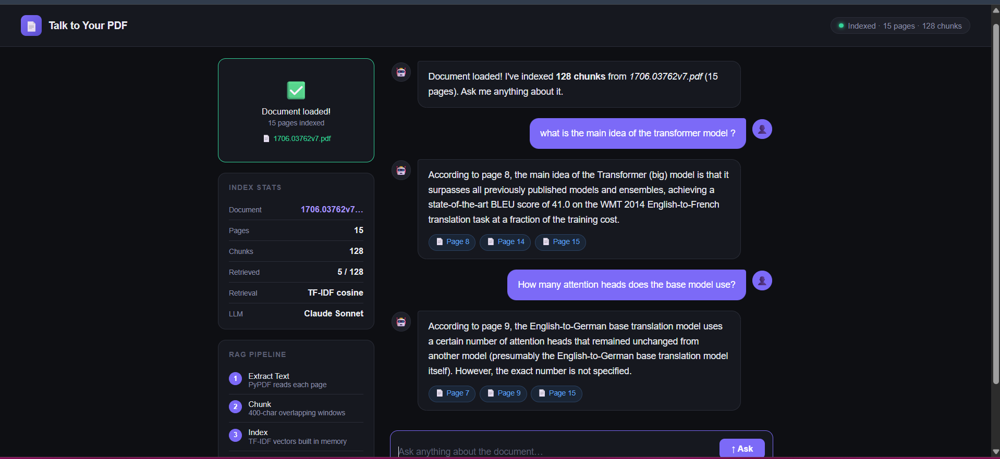
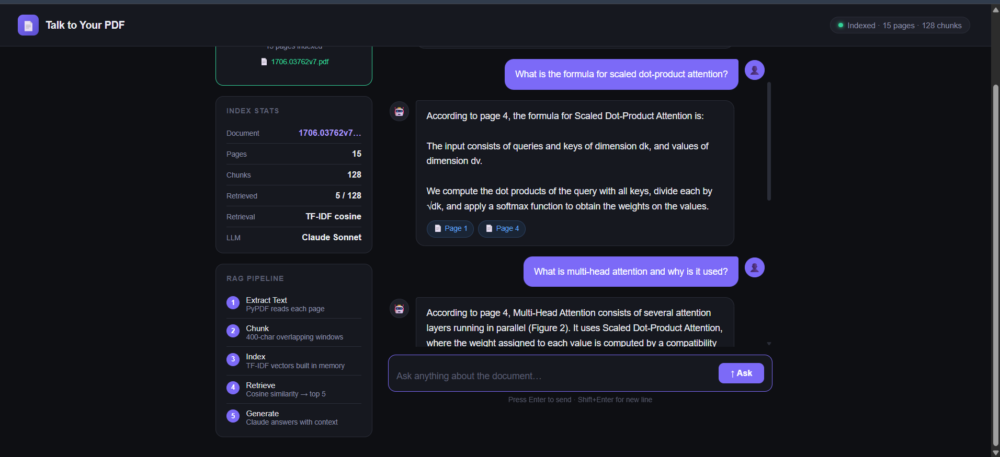
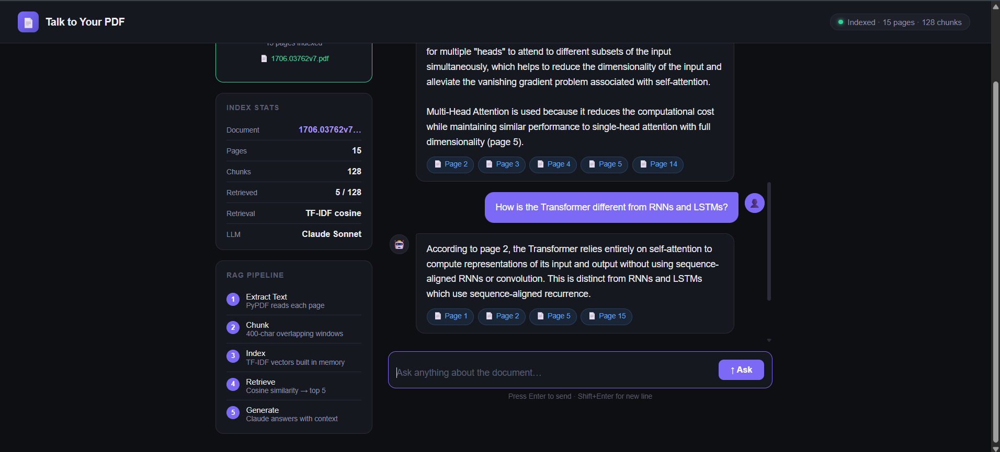

# Talk to Your PDF

**A Full RAG (Retrieval-Augmented Generation) Application**

*Complete Documentation, Code, Pipeline & Live Results*


## 1. What is RAG?

RAG stands for **Retrieval-Augmented Generation**. It combines two things:

- **A retrieval system** finds the most relevant pieces of text from your document
- **A language model (LLM)** — reads those pieces and generates a precise answer

Without RAG, an LLM can only answer from its training data, it knows nothing about your specific PDF. With RAG, you give it the exact relevant passages as context, and it answers only from those. This means:

- **No hallucinations** about your document the model only uses what you gave it
- **Page references** because we track which chunk came from which page
- **Works on any document** technical papers, contracts, manuals, books
- **100% private** with Ollama, nothing leaves your machine

---

## 2. The Full RAG Pipeline

Here is exactly what happens from the moment you upload a PDF to when you get an answer:

| Step | Stage | Description |
|------|-------|-------------|
| **1** | **EXTRACT** | PyPDF reads every page of the PDF and returns raw text per page number |
| **2** | **CHUNK** | Text is split into 400-char overlapping windows (80-char overlap so no sentence is cut) |
| **3** | **INDEX** | TF-IDF vectors are computed for every chunk and stored in memory (`index.json` on disk) |
| **4** | **RETRIEVE** | Your question is vectorized the same way → cosine similarity against all chunks → top 5 returned |
| **5** | **GENERATE** | The 5 most relevant chunks become the context sent to the LLM → it answers with page references |

### 2.1 Step 1 : Extract Text (`app.py`)

When you upload a PDF, PyPDF reads every page and extracts the text content. Each page is cleaned (whitespace normalized) and stored with its page number.

```python
def extract_pages(pdf_path):
    pages = []
    for i, page in enumerate(pypdf.PdfReader(str(pdf_path)).pages, 1):
        text = re.sub(r"\s+", " ", page.extract_text() or "").strip()
        if text:
            pages.append({"page": i, "text": text})
    return pages

# Returns: [{"page": 1, "text": "..."}, {"page": 2, "text": "..."}, ...]
```

### 2.2 Step 2 : Chunking

A full page is too long to compare efficiently. We split each page into overlapping 400-character windows. The 80-character overlap ensures that no sentence is cut off at a boundary, important information at chunk edges is preserved.

```python
CHUNK_SIZE    = 400   # characters per chunk
CHUNK_OVERLAP = 80    # overlap between chunks

def chunk_pages(pages):
    chunks, cid = [], 0
    for p in pages:
        start = 0
        while start < len(p["text"]):
            piece = p["text"][start:start + CHUNK_SIZE].strip()
            if len(piece) > 40:
                chunks.append({"chunk_id": cid, "page": p["page"], "text": piece})
                cid += 1
            start += CHUNK_SIZE - CHUNK_OVERLAP
    return chunks

# The "Attention Is All You Need" paper → 15 pages → 128 chunks
```

> **Why overlap?** Imagine a key sentence spans characters 395–420 of a page. Without overlap, it gets split across two chunks and neither chunk contains the full sentence. With 80-char overlap, both chunks include the boundary region, so the answer is always found.

### 2.3 Step 3 : Building the Index (TF-IDF)

We turn every chunk into a numeric vector using **TF-IDF** (Term Frequency–Inverse Document Frequency). This is a classic information retrieval technique that works without any external AI model or API.

- **TF (Term Frequency)** : how often a word appears in this chunk
- **IDF (Inverse Document Frequency)** : how rare the word is across ALL chunks (rare words get more weight)
- The result is a vector of numbers, one per unique word in the whole document

```python
def build_index(chunks):
    # 1. Build vocabulary: every unique word across all chunks
    vocab = {}
    for c in chunks:
        for t in _tok(c["text"]):
            if t not in vocab: vocab[t] = len(vocab)

    # 2. Compute IDF: log((N+1)/(df+1)) + 1 for each word
    N = len(chunks)
    df = {}  # how many chunks contain each word
    for c in chunks:
        for t in set(_tok(c["text"])): df[t] = df.get(t, 0) + 1

    idf = {t: math.log((N+1)/(v+1))+1 for t, v in df.items()}

    # 3. Build TF-IDF vector for each chunk
    vectors = []
    for c in chunks:
        toks = _tok(c["text"])
        tf = {}
        for t in toks: tf[t] = tf.get(t, 0) + 1
        vec = [0.0] * len(vocab)
        for t, cnt in tf.items():
            if t in vocab:
                vec[vocab[t]] = (cnt/len(toks)) * idf.get(t, 1.0)
        vectors.append(vec)
```

### 2.4 Step 4 : Retrieval (Cosine Similarity)

When you type a question, it is vectorized using the exact same TF-IDF method. Then we compute the **cosine similarity** between the question vector and every chunk vector. The top 5 most similar chunks are returned.

Cosine similarity measures the angle between two vectors, if the question and a chunk use the same important words, their vectors point in similar directions and the cosine score is high (close to 1.0).

```python
def _cosine(a, b):
    dot = sum(x * y for x, y in zip(a, b))
    na  = math.sqrt(sum(x * x for x in a))
    nb  = math.sqrt(sum(x * x for x in b))
    return dot / (na * nb + 1e-9)

def retrieve(query):
    qvec = tfidf_vector(query, vocab, idf)  # same method as chunks
    scored = sorted(
        zip([_cosine(qvec, v) for v in INDEX["vectors"]], INDEX["chunks"]),
        key=lambda x: x[0], reverse=True
    )
    return [c for _, c in scored[:TOP_K]]  # TOP_K = 5
```

### 2.5 Step 5 : Answer Generation (Ollama / llama3.2)

The 5 retrieved chunks are packed into a prompt with their page numbers. This prompt is sent to the local Ollama model (llama3.2). The model is instructed to answer **only** from the provided context preventing it from making things up.

```python
def generate_answer(question, chunks):
    # Build context from retrieved chunks with page numbers
    context = "\n\n---\n\n".join(
        f"[Page {c['page']}]\n{c['text']}" for c in chunks
    )

    prompt = f"""You are a precise document assistant.
    Answer using ONLY the context below.
    Reference page numbers when helpful.

    CONTEXT:
    {context}

    QUESTION: {question}

    ANSWER:"""

    # Send to Ollama running locally on port 11434
    payload = json.dumps({"model": "llama3.2", "prompt": prompt, "stream": False})
    req = urllib.request.Request("http://localhost:11434/api/generate", ...)
    return json.loads(urllib.request.urlopen(req).read())["response"]
```

### 2.6 Persistence : `index.json`

After indexing, the entire index (chunks + vectors + vocabulary + IDF weights) is saved to `index.json`. On every server restart, it loads automatically — you never need to re-upload the same PDF.

```python
def save_index():
    INDEX_FILE.write_text(json.dumps({
        "filename": INDEX["filename"],
        "chunks":   INDEX["chunks"],
        "vectors":  INDEX["vectors"],  # all TF-IDF vectors
        "vocab":    INDEX["vocab"],    # word → index mapping
        "idf":      INDEX["idf"],      # IDF weights
    }))

# On startup:
load_index()  # ← reads index.json if it exists
```

---

## 3. The Backend : `app.py`

The backend is a Flask web server exposing three API endpoints:

| Method | Route | What it does |
|--------|-------|--------------|
| `POST` | `/upload` | Receives PDF → extract → chunk → build TF-IDF index → save to disk |
| `POST` | `/ask` | Receives question → retrieve top 5 chunks → generate answer via Ollama → return JSON |
| `GET` | `/status` | Returns current index state: filename, page count, chunk count |

---

## 4. The Frontend : `index.html`

The UI is a single self-contained HTML file with **no external dependencies**. It is served from Flask's static folder.

### 4.1 Upload Zone

Handles both drag-and-drop and click-to-browse. When a file is selected, it sends a `multipart/form-data` POST to `/upload` and animates a progress bar while the server processes the PDF.

```javascript
async function uploadFile(file) {
    const fd = new FormData();
    fd.append("file", file);
    const res  = await fetch("/upload", { method: "POST", body: fd });
    const data = await res.json();
    // data = { filename, pages, chunks }
    // → update UI stats, enable the question input
}
```

### 4.2 Chat Interface

User messages appear on the right (purple bubble), AI answers on the left (dark bubble). Page citations appear as colored tags below each answer.

```javascript
async function askQuestion() {
    const question = document.getElementById("question-input").value;
    addUserMessage(question);
    addTypingIndicator();       // animated dots while waiting

    const res  = await fetch("/ask", {
        method: "POST",
        headers: { "Content-Type": "application/json" },
        body: JSON.stringify({ question }),
    });
    const data = await res.json();
    // data = { answer, pages_cited: [3, 4, 8], chunks_used: 5 }

    removeTyping();
    addAIMessage(data.answer, data.pages_cited);
}
```

### 4.3 RAG Pipeline Sidebar

The left panel shows live stats (pages, chunks, retrieved count) and a visual pipeline tracker. Steps 1–3 turn purple after upload; steps 4–5 turn purple after the first question is answered.

---

## 5. How to Run the Project

### Step 1 : Install Dependencies

```bash
pip install flask flask-cors pypdf
```

### Step 2 : Install Ollama & Pull the Model

Download Ollama from [https://ollama.com/download](https://ollama.com/download), install it, then run:

```bash
ollama pull llama3.2
# Downloads ~2GB once. Free, local, private.
```

### Step 3 : Start the Server

```bash
cd RAG-App
python app.py

# Output:
# 🚀  Talk to Your PDF — RAG server (Ollama mode)
# ✅ Auto-loaded: "1706.03762v7.pdf" (128 chunks)
# Open http://localhost:5000
```

### Step 4 : Open the App

Navigate to [http://localhost:5000](http://localhost:5000) in your browser.

Upload any PDF, ask questions, and get answers with page references. The index is saved to `index.json` — next time you start the server, the document is already loaded.

---

## 6. Live Results : *Attention Is All You Need*

The following examples show the app running with the original Transformer paper (Vaswani et al., 2017), 15 pages, 128 chunks after processing.

**Figure 1** : Document indexed (128 chunks, 15 pages). First two questions answered with page citations.



**Figure 2** : Formula retrieval: Scaled Dot-Product Attention explained with page 4 citation. Multi-head attention answer begins.



**Figure 3** : Multi-head attention full answer spanning pages 2–5 and 14, followed by *"How is the Transformer different from RNNs and LSTMs?"* — answered with citations from pages 1, 2, 5, and 15.



---

## 7. Project Structure

```
RAG-App/
├── app.py              ← Flask backend (full RAG pipeline)
├── index.json          ← Persisted index (auto-created on first upload)
├── uploads/            ← Saved PDF files
│   └── 1706.03762v7.pdf
└── static/
    └── index.html      ← Complete web UI (no external dependencies)
```

---
